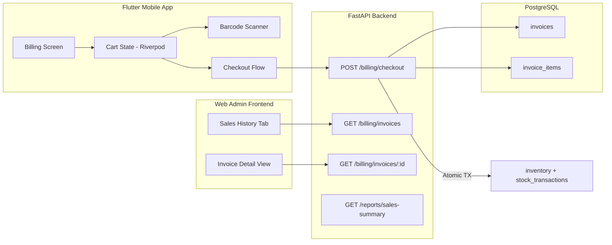
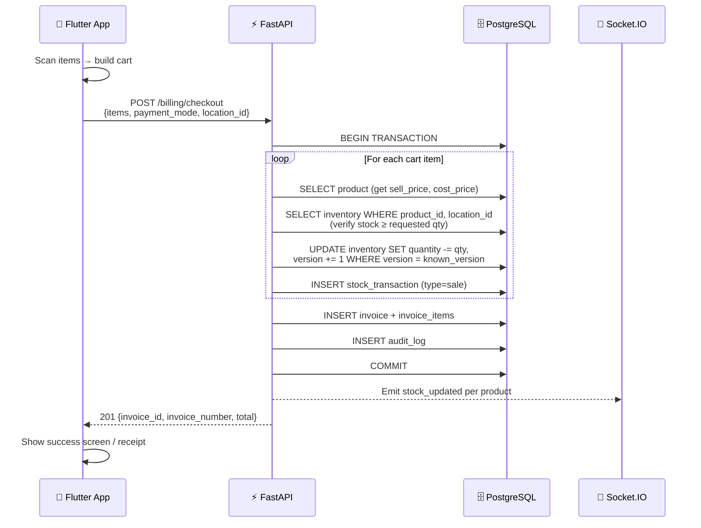

# Adding Billing to the Inventory Management App

## Background & Current State

The application is a **multi-location inventory management system** with:
- **Backend**: FastAPI + PostgreSQL (async via SQLAlchemy 2.0) + Redis + Socket.IO
- **Web frontend**: Vanilla HTML/JS/CSS served via Nginx (admin dashboard)
- **Mobile app**: Flutter (Dart) with Riverpod state management, GoRouter, Dio for HTTP, Drift for offline SQLite, and `mobile_scanner` for barcode scanning

The existing system already has: Products (with `cost_price`, `sell_price`, barcode, SKU), Inventory (per-location stock with optimistic locking), Stock Transactions (immutable audit trail), Users/Roles (admin, manager, staff, viewer), Locations (hierarchical warehouse/store), and Categories/Suppliers.

**What's missing**: There is no concept of a customer-facing sale, invoice, payment, or billing workflow. The `billing_app_about.txt` design document outlines the target architecture with invoices, invoice line items, price snapshotting, and payment modes.

---

## User Review Required

> [!IMPORTANT]
> **Tax Configuration**: The design doc mentions "Tax breakdown" on invoices. Should we implement:
> - (A) A single flat GST rate (e.g., 18%) applied to all products?
> - (B) Per-product tax rates / tax slabs (0%, 5%, 12%, 18%, 28%)?
> - (C) No tax for now — just subtotal-based billing?

> [!IMPORTANT]
> **Customer Records**: Should invoices track a customer name/phone (optional), or are all sales anonymous walk-in sales?

> [!IMPORTANT]
> **Receipt Printing**: The design doc mentions "print the receipt". Should we:
> - (A) Generate a PDF receipt downloadable from the API?
> - (B) Build a thermal-printer-friendly HTML receipt view in the frontend?
> - (C) Skip printing for now and just show an on-screen receipt confirmation?

> [!IMPORTANT]
> **Scope Confirmation**: This plan covers the **full-stack billing feature** across Backend API, Web Frontend, and Flutter Mobile App. Should we implement all three, or prioritize one surface first?

---

## Open Questions

> [!NOTE]
> **Invoice Numbering**: Should invoice numbers follow a specific format (e.g., `INV-2026-00001` with auto-increment per year), or is a simple sequential counter sufficient?

> [!NOTE]
> **Discount Support**: Should the billing engine support line-item discounts or bill-level discounts in the initial release, or defer to a later phase?

---

## Architecture Overview

The billing module follows the design document's three-tier pattern and integrates directly with the existing inventory system:



---

## Proposed Changes

### Phase 1 — Database Layer (Models & Migration)

#### [NEW] [invoice.py](file:///d:/Projects/FL%20Projects/Billing_mobile_app/backend/app/models/invoice.py)

New SQLAlchemy model for the `invoices` table:

| Column | Type | Notes |
|---|---|---|
| `id` | UUID PK | Auto-generated |
| `invoice_number` | String(50), unique, indexed | Sequential format `INV-YYYYMMDD-XXXXX` |
| `location_id` | FK → locations.id | Where the sale happened |
| `user_id` | FK → users.id | Cashier who processed the sale |
| `subtotal` | Numeric(12,2) | Sum of line items before tax |
| `tax_amount` | Numeric(12,2) | Total tax (nullable, defaults 0) |
| `discount_amount` | Numeric(12,2) | Bill-level discount (defaults 0) |
| `total_amount` | Numeric(12,2) | Final payable = subtotal + tax - discount |
| `payment_mode` | Enum: `cash`, `upi`, `card` | How the customer paid |
| `customer_name` | String(150), nullable | Optional walk-in customer name |
| `customer_phone` | String(20), nullable | Optional phone for SMS receipt |
| `notes` | Text, nullable | Cashier notes |
| `created_at` | DateTime(tz) | Timestamp of the sale |

#### [NEW] [invoice_item.py](file:///d:/Projects/FL%20Projects/Billing_mobile_app/backend/app/models/invoice_item.py)

New SQLAlchemy model for the `invoice_items` table:

| Column | Type | Notes |
|---|---|---|
| `id` | UUID PK | Auto-generated |
| `invoice_id` | FK → invoices.id | Parent invoice |
| `product_id` | FK → products.id | What was sold |
| `quantity` | Integer | How many units sold |
| `unit_price` | Numeric(12,2) | **Price snapshot** at time of sale (from `sell_price`) |
| `cost_price` | Numeric(12,2), nullable | **Cost snapshot** for profit calculation |
| `line_total` | Numeric(12,2) | `quantity × unit_price` |

> [!TIP]
> **Price Snapshotting** (from design doc): The `unit_price` and `cost_price` columns capture the price at the moment of sale. Future product price changes will never alter historical invoice calculations.

#### [MODIFY] [__init__.py](file:///d:/Projects/FL%20Projects/Billing_mobile_app/backend/app/models/__init__.py)
- Register `InvoiceModel` and `InvoiceItemModel` in the models package.

#### [NEW] [002_add_billing_tables.py](file:///d:/Projects/FL%20Projects/Billing_mobile_app/backend/alembic/versions/002_add_billing_tables.py)
- Alembic migration to create `invoices` and `invoice_items` tables.
- Add index on `invoices.created_at` for date-range reporting.
- Add index on `invoices.location_id` for location-scoped queries.

---

### Phase 2 — Backend API (Schemas, Service, Router)

#### [NEW] [billing.py](file:///d:/Projects/FL%20Projects/Billing_mobile_app/backend/app/schemas/billing.py)

Pydantic schemas:

- **`CheckoutRequest`**: `location_id`, `payment_mode`, `customer_name?`, `customer_phone?`, `notes?`, `items: list[CheckoutItem]`
- **`CheckoutItem`**: `product_id`, `quantity`, `known_version` (for optimistic locking per item)
- **`InvoiceResponse`**: Full invoice with nested line items
- **`InvoiceListItem`**: Lightweight summary for list views
- **`PaginatedInvoiceResponse`**: Paginated invoice list

#### [NEW] [billing_service.py](file:///d:/Projects/FL%20Projects/Billing_mobile_app/backend/app/services/billing_service.py)

Core checkout business logic — **the most critical file**:

```
async def process_checkout(db, data: CheckoutRequest, user_id, ip_address):
    """
    Atomic checkout within a single DB transaction:
    
    1. For each item in the cart:
       a. Fetch product → snapshot sell_price and cost_price
       b. Fetch inventory → verify stock >= requested quantity
       c. Optimistic-lock update inventory (deduct stock)
       d. Record stock_transaction (type="sale", referencing invoice)
       e. Build InvoiceItemModel with snapshotted prices
    
    2. Calculate subtotal, tax, discount, total
    3. Generate sequential invoice_number
    4. Persist InvoiceModel + all InvoiceItemModels
    5. Write audit log
    6. Emit Socket.IO event for real-time dashboard updates
    7. Return the created invoice
    
    If ANY step fails → entire transaction rolls back,
    no stock is deducted, no invoice is created.
    """
```

Key robustness features (from design doc):
- **Concurrency control**: Uses existing optimistic locking (`known_version`) per inventory item
- **Atomic transactions**: Entire checkout wrapped in a single `db.begin()` block
- **Stock validation**: `quantity_requested <= available_stock` check before deduction

#### [NEW] [billing.py](file:///d:/Projects/FL%20Projects/Billing_mobile_app/backend/app/routers/billing.py)

API endpoints:

| Method | Path | Description |
|---|---|---|
| `POST` | `/api/v1/billing/checkout` | Process a cart checkout (creates invoice, deducts stock) |
| `GET` | `/api/v1/billing/invoices` | List invoices (paginated, filterable by date/location/payment) |
| `GET` | `/api/v1/billing/invoices/{id}` | Get full invoice with line items |
| `GET` | `/api/v1/billing/daily-summary` | Today's sales count, revenue, profit |

#### [MODIFY] [main.py](file:///d:/Projects/FL%20Projects/Billing_mobile_app/backend/app/main.py)
- Register the new `billing` router via `application.include_router(billing.router)`.

#### [MODIFY] [stock_transaction.py](file:///d:/Projects/FL%20Projects/Billing_mobile_app/backend/app/models/stock_transaction.py)
- Add `sale` to the `TransactionType` enum so stock deductions from billing are distinctly tracked as sales (separate from manual dispatches).

#### [MODIFY] [report_service.py](file:///d:/Projects/FL%20Projects/Billing_mobile_app/backend/app/services/report_service.py)
- Add `total_sales_today`, `revenue_today` metrics to the dashboard summary.

#### [MODIFY] [reports.py](file:///d:/Projects/FL%20Projects/Billing_mobile_app/backend/app/schemas/reports.py)
- Extend `SummaryResponse` with `total_sales_today: int` and `revenue_today: float`.

#### [MODIFY] [seed.py](file:///d:/Projects/FL%20Projects/Billing_mobile_app/backend/app/seed.py)
- Optionally seed a few demo invoices for testing.

---

### Phase 3 — Web Admin Frontend (Sales History)

#### [MODIFY] [index.html](file:///d:/Projects/FL%20Projects/Billing_mobile_app/frontend/index.html)
- Add a **"Sales"** sidebar nav item (between "Inventory" and "Pending Approvals").
- Add the `#sales-section` content panel with:
  - Filter bar (date range, payment mode, location)
  - Sales table: Invoice #, Date, Items count, Total, Payment Mode, Cashier
  - Click-to-expand invoice detail modal showing line items
- Update the Dashboard section to show today's sales count + revenue in the stats grid.

#### [MODIFY] [app.js](file:///d:/Projects/FL%20Projects/Billing_mobile_app/frontend/app.js)
- Add `loadSalesData()` function to fetch and render invoice list.
- Add `viewInvoiceDetail(invoiceId)` function for the modal.
- Register the "Sales" tab in the navigation handler.
- Update `loadDashboardData()` to display sales metrics.

#### [MODIFY] [styles.css](file:///d:/Projects/FL%20Projects/Billing_mobile_app/frontend/styles.css)
- Style the invoice detail modal and sales-specific badge (payment mode indicators).

---

### Phase 4 — Flutter Mobile App (Billing Screen)

This is the primary user-facing billing interface for the cashier.

#### [NEW] `flutter_app/lib/features/billing/` feature module

Structure following existing feature pattern:
```
billing/
├── domain/
│   ├── billing_notifier.dart      # Riverpod state (cart + checkout)
│   ├── cart_state.dart             # Cart model (items, totals)
│   └── billing_repository.dart     # API calls via Dio
├── data/
│   └── billing_api.dart            # Dio HTTP client for billing endpoints
└── presentation/
    ├── billing_screen.dart         # Main POS screen (scan + cart)
    ├── cart_sheet.dart             # Bottom sheet showing cart items
    ├── checkout_dialog.dart        # Payment mode selection + confirm
    └── invoice_success_screen.dart # Post-checkout receipt view
```

**`billing_screen.dart`** — The core POS interface:
- Full-screen barcode scanner (reusing existing `mobile_scanner` setup)
- Scanned product auto-adds to cart with quantity = 1 (tap to adjust)
- Persistent bottom bar showing cart item count + running total
- "Checkout" FAB button → opens `checkout_dialog.dart`

**`cart_state.dart`** — Riverpod-managed cart:
- `List<CartItem>` with product details, quantity, unit price
- Computed `subtotal`, `tax`, `total`
- Add/remove/update quantity methods
- Auto-fetch product details + current stock on scan

**`checkout_dialog.dart`** — Payment flow:
- Payment mode selector (Cash / UPI / Card) with icons
- Optional customer name + phone fields
- "Confirm Sale" button → calls `POST /billing/checkout`
- Success → clears cart, shows `invoice_success_screen`
- Failure → shows error (stock insufficient, network error)

#### [MODIFY] [router.dart](file:///d:/Projects/FL%20Projects/Billing_mobile_app/flutter_app/lib/router.dart)
- Add `/billing` route for the new billing screen.
- Add `/billing/success/:invoiceId` route for the post-checkout view.

#### [MODIFY] [dashboard_screen.dart](file:///d:/Projects/FL%20Projects/Billing_mobile_app/flutter_app/lib/features/dashboard/presentation/dashboard_screen.dart)
- Add a "Billing" item to the bottom navigation bar (between "Scan" and "Reports").
- Update the bottom nav `onTap` handler to route to `/billing`.
- Add a "Today's Sales" metric card to the dashboard grid.

#### [MODIFY] [pubspec.yaml](file:///d:/Projects/FL%20Projects/Billing_mobile_app/flutter_app/pubspec.yaml)
- No new dependencies needed — existing `mobile_scanner`, `dio`, `riverpod`, `intl` (for ₹ formatting) cover all requirements.

---

## Data Flow — Checkout Transaction



---

## Verification Plan

### Automated Tests

1. **Backend unit tests** — `tests/test_billing.py`:
   - Test successful checkout (stock deducted, invoice created, line items correct)
   - Test insufficient stock rejection (cart with qty > available)
   - Test optimistic lock conflict (concurrent checkouts for last item)
   - Test price snapshotting (change price after sale, verify invoice unchanged)
   - Test invoice listing with filters

2. **API integration tests**:
   - `POST /billing/checkout` with valid cart → 201
   - `POST /billing/checkout` with out-of-stock item → 409/400
   - `GET /billing/invoices` → paginated list
   - `GET /billing/invoices/{id}` → full invoice with line items

### Manual Verification

1. **Web frontend**: Navigate to Sales tab → verify invoice list renders, detail modal works
2. **Flutter app**: Scan product → add to cart → checkout → verify stock deducted on web admin
3. **Browser recording**: Capture end-to-end checkout flow via browser subagent
